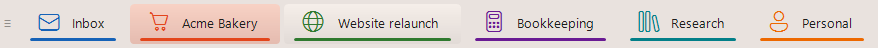
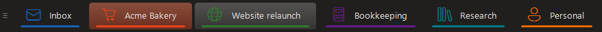

# DeskTabs

[🇬🇧 English](README.md) · 🇩🇪 **Deutsch**

**Klickbare Desktop-Leiste für die virtuellen Desktops von Windows 11.** Sitzt unten links in der Taskleiste, ein Button pro virtuellem Desktop, beschriftet mit dem Windows-Namen des Desktops. Klick = dorthin wechseln, der aktive Desktop ist hervorgehoben.

Entwickelt von [Henning Pähtz](https://paehtz.de) als schlankes Werkzeug fürs Zeit-Tracking pro Projekt: ein Desktop = ein Kunde, immer einen Klick entfernt.






---

## Hintergrund

Ich strukturiere meine Projekte und mein Zeit-Tracking über virtuelle Desktops: pro Projekt ein Desktop mit genau den Fenstern und der Oberfläche, die ich dafür brauche. Das Umschalten erfüllt dabei zwei Zwecke gleichzeitig. Erstens wechselt es den kompletten Arbeitskontext, alle Fenster des Projekts sind sofort da. Zweitens erfasst [ManicTime](https://www.manictime.com), womit ich meine Arbeitszeit tracke, den jeweils aktiven Desktop. In der Tagesansicht kann ich später präzise nachvollziehen, wann und wie lange ich an welchem Projekt gearbeitet habe.

Damit das sauber funktioniert, muss ich jederzeit sehen, auf welchem Desktop ich gerade bin. Früher ist es mir öfter passiert, dass ich eine Aufgabe versehentlich auf dem falschen Desktop erledigt habe, was die spätere Auswertung verfälscht und Nacharbeit bedeutet. DeskTabs löst das: eine dauerhaft sichtbare Leiste zeigt den aktiven Desktop, und ein direkter Klick wechselt dorthin, statt sich mit dem Windows-Shortcut durchzuschalten. So lande ich immer im richtigen Kontext, und die Zeit wird dem richtigen Projekt zugeordnet.

---

## Was es kann

- **Live-Namen aus Windows:** die Button-Beschriftung kommt direkt aus den in Windows benannten Desktops (Task-Ansicht). Nichts wird doppelt gepflegt.
- **Dynamisch:** Desktop hinzufügen/entfernen in Windows → die Leiste passt sich innerhalb ~1,2 s automatisch an (oder Tray → „Leiste neu aufbauen").
- **Nativer Wechsel:** Klick bildet `Win+Strg+Pfeil` nach. Fenster bleiben stabil auf ihren Desktops (anders als `GoToDesktopNumber`, das auf 24H2/25H2 das Fokusfenster mitnimmt).
- **Auf allen Desktops sichtbar:** das Fenster ist an alle Desktops gepinnt.
- **Hell/Dunkel automatisch:** folgt dem Windows-Theme (Taskleisten-Helligkeit), umschaltbar oder fest einstellbar.
- **Index-Präfix:** „3 · Projektname" (abschaltbar).
- **Farbcodierung:** dünner Farbbalken pro Desktop (Tab-Indikator-Stil, abschaltbar, pro Desktop überschreibbar).
- **Hover-Effekt:** Button unter der Maus hellt auf.
- **Klick auf aktiven Desktop:** öffnet die Task-Ansicht (Win+Tab).
- **Vollbild-Auto-Hide:** blendet sich aus, wenn eine Vollbild-App im Vordergrund ist.
- **Mausrad** über der Leiste blättert durch die Desktops.
- **Trennstriche** zwischen den Buttons (dezent).
- **Verschiebbar** am Griff `≡` links; Position wird in `settings.ini` gemerkt.

---

## Voraussetzungen

- **Windows 11:** entwickelt und getestet auf **25H2 (Build 26200)**. Funktioniert ab 24H2 (26100).
- **AutoHotkey v2** (getestet mit 2.0.26), Standardpfad `C:\Program Files\AutoHotkey\v2\AutoHotkey64.exe`.
- **VirtualDesktopAccessor.dll** (liegt im Repo bei), von [Ciantic/VirtualDesktopAccessor](https://github.com/Ciantic/VirtualDesktopAccessor), Release `2024-12-16-windows11`.

---

## Installation & Start

### Variante A: sofort startklar (ohne AutoHotkey)

1. Die neueste `DeskTabs-vX.Y.Z.zip` von der [Releases-Seite](https://github.com/paehtz/DeskTabs/releases/latest) herunterladen.
2. Irgendwohin entpacken und `DeskTabs.exe` und `VirtualDesktopAccessor.dll` zusammen im selben Ordner lassen.
3. Doppelklick auf `DeskTabs.exe`.

Oder per Einzeiler installieren (und aktualisieren) in PowerShell:

```powershell
irm https://raw.githubusercontent.com/paehtz/DeskTabs/main/setup.ps1 | iex
```

Das installiert DeskTabs nach `%LOCALAPPDATA%\DeskTabs`, legt einen Autostart-Eintrag an und startet es. Erneut ausführen aktualisiert auf die neueste Version.

> Hinweis: Eine mit AutoHotkey kompilierte `.exe` kann bei manchen Virenscannern Fehlalarme auslösen. Deshalb gibt es immer beides, die `.exe` und den vollständigen Quellcode; Du kannst stattdessen jederzeit aus dem Quellcode starten.

### Variante B: aus dem Quellcode

1. Repo klonen oder als ZIP herunterladen und in einen Ordner Deiner Wahl entpacken.
2. [AutoHotkey v2](https://www.autohotkey.com/) installieren (falls noch nicht vorhanden).
3. Doppelklick auf `DeskTabs.ahk` (öffnet mit AHK v2), oder per Kommandozeile:

```
"C:\Program Files\AutoHotkey\v2\AutoHotkey64.exe" "<Pfad-zum-Ordner>\DeskTabs.ahk"
```

**Autostart:** Eine Verknüpfung in den Autostart-Ordner legen
(`%APPDATA%\Microsoft\Windows\Start Menu\Programs\Startup\`)
→ Ziel: `AutoHotkey64.exe`, als Argument der Pfad zu `DeskTabs.ahk`.

**Beenden / Steuern:** Tray-Icon (Bildschirm-Symbol) → Rechtsklick:
- Leiste neu aufbauen
- Position zurücksetzen
- Beenden

---

## Konfiguration

Alle Optionen stehen im `CONF`-Block ganz oben in `DeskTabs.ahk`:

| Option | Default | Bedeutung |
|---|---|---|
| `DockMode` | `on` | `on` = auf der Taskleiste (optisch integriert, kann beim Fensterwechsel minimal flackern). `above` = knapp über der Taskleiste (flackerfrei, überlagert aber die unterste Fensterkante). |
| `ThemeMode` | `auto` | `auto` = folgt dem Windows-Theme (Taskleisten-Helligkeit via Registry `SystemUsesLightTheme`). `light` / `dark` = fest. Wechsel zur Laufzeit wird automatisch erkannt (~1,2 s) und die Leiste neu gebaut. |
| `OffsetX` | 10 | Abstand vom linken Bildschirmrand (px). |
| `SwitchMethod` | `native` | `native` = Win+Strg+Pfeil nachbilden (Fenster bleiben stabil). `dll` = `GoToDesktopNumber` (schneller, nimmt aber Fenster mit). |
| `ShowIndex` | 1 | Nummern-Präfix („3 · …"). |
| `ColorCoding` | 1 | Farbbalken pro Desktop. |
| `AccentBarH` | 3 | Höhe des Farbbalkens (px). |
| `AutoHideFullscreen` | 1 | Bei Vollbild-App ausblenden. |
| `ClickActiveTaskView` | 1 | Klick auf aktiven Desktop öffnet Win+Tab. |
| `WheelSwitch` | 1 | Mausrad blättert Desktops. |
| `Palette` | 8 Farben | Farbpalette für die Farbcodierung (nach Index). |
| `FontSizePt` | 10 | Schriftgröße. |
| `MaxNameLen` | 22 | Namen länger als das werden gekürzt. |
| Farben | auto | `ColBarBg`, `ColInactiveBg/Tx`, `ColActiveBg/Tx`, `ColHoverBg/Tx`, `ColDivider` werden beim Start aus `THEME_LIGHT` / `THEME_DARK` (je nach `ThemeMode`) in die CONF übernommen. Anpassen → die beiden `THEME_*`-Maps oben im Skript. |

### settings.ini (wird automatisch angelegt)

```ini
[Position]
X=10
Y=1392

[Colors]
; Farbcodierung pro Desktop-Name überschreiben (RRGGBB):
Design=E5471D
Buchhaltung=1565C0
```

---

## Wie es funktioniert (Architektur)

- **Lesen der Desktops** über `VirtualDesktopAccessor.dll` (in-process, schnell): `GetDesktopCount`, `GetCurrentDesktopNumber`, `GetDesktopName`, `PinWindow`, `RegisterPostMessageHook`.
- **Wechseln** über simulierte Tastenkürzel (`SwitchMethod=native`), nicht über die DLL, das verhindert das Mitwandern von Fenstern.
- **Live-Update der Hervorhebung** via `RegisterPostMessageHook` (Desktop-Wechsel-Benachrichtigung) + 1,2-s-Fallback-Timer (`Refresh`), der auch Desktop-Anzahl/Namen aktualisiert und die Leiste bei Bedarf neu baut.
- **Immer im Vordergrund** (`DockMode=on`): Kombination aus
  - `SetWinEventHook(EVENT_SYSTEM_FOREGROUND)` → bei jedem Fensterwechsel sofort `AssertTop()`,
  - kurzer **Burst** (10× alle 25 ms) zum Abdecken von Maximier-Animationen,
  - 250-ms-Backstop-Timer.
- **Fenster** ist `-Caption +AlwaysOnTop +ToolWindow +E0x08000000` (WS_EX_NOACTIVATE → Klicks klauen nicht den Fokus vom Arbeitsfenster) und an alle Desktops gepinnt.
- **Theme** wird über die Registry erkannt (`SystemUsesLightTheme` unter `…\Themes\Personalize`, derselbe Wert, der die Taskleisten-Helligkeit steuert). `ApplyTheme()` kopiert den passenden Satz (`THEME_LIGHT`/`THEME_DARK`) in die CONF-Farbschlüssel; der `Refresh`-Timer erkennt einen Theme-Wechsel und baut die Leiste neu.

---

## Erkenntnisse / Stolpersteine (für künftige Wartung)

- **25H2-Kompatibilität:** Die Ciantic-DLL ist mit „24H2" gelabelt, läuft aber auf 25H2 (26200) einwandfrei. Bei einem Windows-Feature-Update, das die Virtual-Desktop-COM-VTable ändert, kann die DLL brechen → dann neue Version von Ciantics Repo holen.
- **`GoToDesktopNumber` nimmt Fenster mit:** Auf 24H2/25H2 nutzt die DLL intern `switch_desktop_and_move_foreground_view`. Deshalb `SwitchMethod=native` (Tastenkürzel-Nachbau).
- **`&` im Desktop-Namen:** AHK-Text-Controls interpretieren `&` als Tastenkürzel-Markierung. Lösung: Style `SS_NOPREFIX` (`+0x80`) auf die Buttons, das zeigt `&` wörtlich (z.B. „T&K").
- **z-Order der Farbbalken/Trennstriche:** Überlappende Controls werden vom Button verdeckt. Deshalb liegen Trennstriche in den Lücken und Farbbalken **unter** dem Button (überlappungsfrei).
- **AHK-Semikolon-Falle:** Ein `;` ohne Leerzeichen davor ist KEIN Kommentar, sondern wirft „Illegal character in expression". Inline-Kommentare immer mit Leerzeichen vor `;`.
- **DockMode-Abwägung:** `on` (auf der Taskleiste) sieht integrierter aus, kämpft aber mit der Taskleiste um die z-Order (kurzes Flackern beim Fensterwechsel trotz WinEvent-Hook + Burst). `above` (knapp darüber) ist flackerfrei, überlagert aber die unterste Fensterkante.
- **Multi-Monitor:** Die Leiste sitzt immer auf der **Primär-Taskleiste** (`Shell_TrayWnd`) und folgt automatisch, wenn sich der Primärmonitor in Windows ändert. Sekundäre Taskleisten (`Shell_SecondaryTrayWnd`) werden nicht bespielt.
- **DLL-Funktionsumfang:** `VirtualDesktopAccessor.dll` bietet KEINE Funktion zum Umsortieren von Desktops (geprüfte Exports u.a. `GetDesktopCount`, `GetCurrentDesktopNumber`, `GetDesktopName`, `GoToDesktopNumber`, `MoveWindowToDesktopNumber`, `PinWindow`, `RegisterPostMessageHook`, aber kein `MoveDesktop`). Fürs Umsortieren müsste [MScholtes/VirtualDesktop](https://github.com/MScholtes/VirtualDesktop) her.

---

## Ideen für die Zukunft

- **Rest-Flackern in `DockMode=on` final lösen:** dauerhaft auf der Taskleiste ohne Zucken beim Fensterwechsel. Ansätze: zusätzliche WinEvents (`EVENT_OBJECT_REORDER`, `EVENT_SYSTEM_MINIMIZEEND`), dichterer Burst, oder die Leiste als Kind der Taskleiste (`SetParent`). Aktueller Standard-Workaround: `DockMode=above` (flackerfrei).
- **Drag-to-Reorder** der Buttons mit echter Windows-Umsortierung über [MScholtes/VirtualDesktop](https://github.com/MScholtes/VirtualDesktop).

---

## Über dieses Projekt

DeskTabs ist KI-unterstützt mit [Claude Code](https://claude.com/claude-code) entstanden. Mein Hintergrund liegt in Strategie, Design und Konzeption, nicht in klassischer Softwareentwicklung: Programmiererfahrung hatte ich vor allem aus Templatesprachen, HTML und CSS. Mit KI-gestütztem Arbeiten setze ich eigene Ideen heute direkt in funktionierende Werkzeuge um. DeskTabs ist eines davon und zugleich ein praktisches Beispiel für genau das, was ich als KI-Beratung an Unternehmen weitergebe.

## Lizenz

DeskTabs steht unter der [MIT-Lizenz](LICENSE) © Henning Pähtz.

**Haftungsausschluss:** DeskTabs wird „wie besehen" bereitgestellt, ohne jede Gewährleistung und ohne Haftung, wie in der MIT-Lizenz festgehalten. Nutzung auf eigenes Risiko.

### Drittkomponenten

- **VirtualDesktopAccessor.dll** ([Ciantic](https://github.com/Ciantic/VirtualDesktopAccessor)) ist unter der **MIT-Lizenz** beigelegt.
- Die kompilierte **`DeskTabs.exe`** (in den Releases) bettet den **AutoHotkey**-Interpreter ein, der unter **GPL-2.0** steht. Die kompilierte exe wird daher unter GPL-2.0 verteilt; der Skript-Quellcode liegt in diesem Repo, der AutoHotkey-Quellcode auf der [Projektseite](https://github.com/AutoHotkey/AutoHotkey). Beim Start aus dem Quellcode (`DeskTabs.ahk`) wird AutoHotkey nicht mitgeliefert.

Vollständige Hinweise: [THIRD-PARTY-LICENSES.md](THIRD-PARTY-LICENSES.md).

---

## Autor

**Henning Pähtz:** Diplom-Medienwissenschaftler aus Lutherstadt Eisleben. Webdesign, Markenstrategie, KI-Beratung und Prozessautomatisierung.

🌐 [paehtz.de](https://paehtz.de) · ✉️ henning@paehtz.de

---

## Credits

- [Ciantic/VirtualDesktopAccessor](https://github.com/Ciantic/VirtualDesktopAccessor): DLL für den Zugriff auf die Windows-Virtual-Desktop-API.
- [AutoHotkey v2](https://www.autohotkey.com/)
