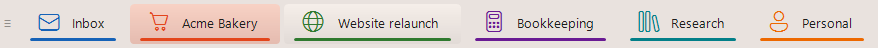
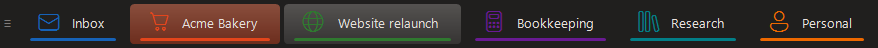

# DeskTabs

🇬🇧 **English** · [🇩🇪 Deutsch](README.de.md)

**A clickable desktop bar for the virtual desktops of Windows 11.** It sits in the lower left of the taskbar, one button per virtual desktop, labelled with the desktop's Windows name. Click to switch there; the active desktop is highlighted.

Built by [Henning Pähtz](https://paehtz.de) as a lean tool for per-project time tracking: one desktop = one client, always a single click away.






---

## ⬇ Download

**[Setup (recommended, 2.7 MB)](https://github.com/paehtz/DeskTabs/releases/latest/download/DeskTabs-Setup-latest.exe)** — a normal wizard: pick a folder (or keep the suggested one), tick autostart, done. No admin rights, and it appears in *Apps & features* like any other program.

**[Portable ZIP (0.9 MB)](https://github.com/paehtz/DeskTabs/releases/latest/download/DeskTabs-latest.zip)** — unpack it anywhere and run `DeskTabs.exe`. Nothing is installed, nothing is written to the registry; deleting the folder removes everything.

Prefer one line in PowerShell? This downloads the latest version, puts it in `%LOCALAPPDATA%\DeskTabs`, starts it and sets up autostart:

```powershell
irm https://raw.githubusercontent.com/paehtz/DeskTabs/main/setup.ps1 | iex
```

All versions and their release notes are on the [Releases page](https://github.com/paehtz/DeskTabs/releases). Windows SmartScreen may warn on first start because the file is not signed: **More info → Run anyway**.

### If Windows blocks the app

DeskTabs is not code-signed yet (a certificate costs money every year; free signing for open source is being applied for). Two different Windows features can react to that:

- **SmartScreen** shows "Windows protected your PC". Click **More info → Run anyway**. This is the common case.
- **Smart App Control** says "blocked an app that might be unsafe" and gives you **no way to allow it** — there is no per-app exception. If your Windows has it switched on, run DeskTabs from source instead: install [AutoHotkey v2](https://www.autohotkey.com/), download the [source as a ZIP](https://github.com/paehtz/DeskTabs/archive/refs/heads/main.zip) (it contains the DLL, `lang\` and `data\`), unpack it and double-click `DeskTabs.ahk`. Verified on a Windows 11 laptop with Smart App Control switched on: AutoHotkey installs and the script runs with every feature, no warning. Please do not switch Smart App Control off just for this app.

---

## Background

I organise my projects and my time tracking around virtual desktops: one desktop per project, with exactly the windows and the layout I need for it. Switching desktops serves two purposes at once. First, it swaps the entire working context: every window of the project is instantly there. Second, [ManicTime](https://www.manictime.com), which I use to track my working hours, records the active desktop. In the daily view I can later see precisely when and how long I worked on which project.

For this to stay clean, I need to see at any moment which desktop I am on. In the past I often ran a task on the wrong desktop by accident, which skews the later evaluation and means rework. DeskTabs solves that: a permanently visible bar shows the active desktop, and a direct click switches to it instead of cycling through the Windows shortcut. So I always land in the right context, and the time is attributed to the right project.

---

## Features

- **Live names from Windows:** the button labels come straight from the desktops you named in Windows (Task View). Nothing is maintained twice.
- **Dynamic:** add or remove a desktop in Windows → the bar adapts automatically within ~1.2 s (or via Tray → "Rebuild bar").
- **Create, rename, remove and reorder desktops right from the bar:** *New desktop…* in the grip menu ≡ (asks for the name and switches there), *Rename…* and *Remove desktop…* in a tab's menu. To reorder, **drag a tab sideways** like a browser tab: the other tabs glide aside while you drag, and Windows (Task View included) takes over the new order. A plain click still switches, Shift + click still sends the active window. Removing asks first and says how many windows move to which desktop, because Windows closes none of them. Colour, icon, abbreviation and the compact setting follow a desktop when you rename it, here or in Windows Task View (DeskTabs recognises each desktop by its Windows ID).
- **Direct jump:** a click jumps straight to the target desktop in one step (~100 ms), no stepping through the desktops in between. Measured on 25H2 (26200) the focused window stays where it is; if a build does drag it along, DeskTabs moves it right back. Step-by-step switching (`Win+Ctrl+Arrow` emulation) is still available via *More settings › Jump directly instead of stepping through*.
- **Unexpected switches are flagged:** when another app pulls you to a different desktop (say, a PDF opens in a reader that lives elsewhere), the new tab flashes orange and keeps a frame until you hover it, and a hint tells you which app is now in front. Your own switches (tabs, wheel, number keys, Ctrl+Win+Arrow, Task View) stay quiet.
- **Send windows to another desktop:** right-click a tab and choose *Move “…” here* to send the window you are working in to that desktop, or press Ctrl+Win+Shift+1 … 0 (with the keyboard shortcuts on). Quickest: **Shift + click** a tab; **Ctrl + Shift + click** takes the window along and switches there too. *Bring a window here ›* lists every window of your current desktop. Or simply drag a window by its title bar onto a tab and let go: it moves there and keeps its size and position. You stay where you are.
- **Show a window on all desktops:** right-click the grip ≡ and tick *Show “…” on all desktops* (or *All windows of “…” on all desktops* for the whole app), or drag the window by its title bar onto ≡. Drag it onto ≡ again, or onto a tab, and it lives on one desktop only again. A right-click on any tab shows the tick as well; untick it there to keep the window on that desktop only. DeskTabs respects the Windows setting: a window shown on all desktops that you move to a tab loses that setting openly (the tip says so); an app set to all desktops is left untouched.
- **Back to the last desktop:** middle-click the bar or press Ctrl+Win+Backspace to return to the desktop you last worked on (quick pass-throughs don't count).
- **Attention dot:** when an app on another desktop flashes for attention, its tab gets a small orange dot until you go there.
- **Visible on all desktops:** the bar itself is pinned to every desktop.
- **Light/Dark automatic:** follows the Windows theme (taskbar brightness), switchable or fixed.
- **Index prefix:** "3 · ProjectName" (can be disabled).
- **Colour coding:** a thin colour bar per desktop (tab-indicator style, can be disabled, overridable per desktop). *Take the colour from the icon* reads the dominant colour out of a fetched site icon and uses it for that desktop.
- **Icon library:** a built-in picker over the whole `Segoe Fluent Icons` font that Windows 11 ships with (1500+ icons), searchable in English and German, with quick filters and a scrollable grid. Click an icon to mark it, then OK (or double-click). The current icon is preselected. Library icons are drawn in the desktop's own colour and stored as `[Icons] Desktop = glyph:E713`.
- **Desktop numbers:** a small numbered badge on the top left of each icon shows which number key jumps there (on automatically while the keyboard shortcuts are on; desktop 10 shows `0`). Or use the number itself as the icon: a filled circle in the desktop colour, per desktop via *Icon → Number as icon* (`[Icons] Desktop = number`) or for all desktops without an icon of their own.
- **Tab icons:** give a desktop an icon from a website (DeskTabs fetches the site icon in the best resolution it can find and caches it) or from your own image file. Right-click a tab → *Icon*, or set `[Icons] Desktop name = URL or path` in `settings.ini`. The bare domain is enough, no `https://www.` needed.
- **Fluent look:** rounded tabs, the active desktop tinted in its own colour (hue kept, lightness from the theme), subtle vertical gradients, hover lightens the tab like the Windows taskbar buttons. The active style is switchable: own desktop colour, uniform accent colour, or a solid fill.
- **Click on the active desktop:** opens Task View (Win+Tab).
- **Fullscreen auto-hide:** hides itself while a fullscreen app is on top on the bar's monitor (a fullscreen video on another monitor does not hide it; a fullscreen app stays respected even when you focus another monitor).
- **Compact levels:** `full` / `short` / `icon`, automatic by available width or manual via **Ctrl + mouse wheel** over the bar. Fits narrow laptop taskbars.
- **Compact single desktops:** right-click a tab → *Compact (icon only)* for projects that rest for a while but stay open. Their tab shows only its icon (or abbreviation/number), the busy desktops keep their full size. Hover a tab that does not show its whole name and a tooltip tells you which desktop it is.
- **Built-in time log:** writes how long you stayed on which desktop to a monthly CSV (`timelog\desktop-log_YYYY-MM.csv`), pauses on lock screen and after 5 min without input. For anyone without a time tracker, and for coding agents that do your billing. See [Time log](#time-log).
- **Right-click menu:** right-click a tab to move windows there and for its icon, colour and abbreviation, plus all app settings: *View* (what a tab shows, icons, numbers, colour bars), *Active desktop*, *Light or dark*, *Keyboard shortcuts*, *Language*, and under *More settings* direct jumping, snapping, switch alerts, the attention dot, dragging windows onto tabs and the time log. No file editing needed; everything is saved to `settings.ini`. The tray icon offers the same menu directly.
- **Help menu:** documentation, changelog, bug report and feature request (opens a pre-filled GitHub issue), e-mail to the author, update check and *About DeskTabs* (version, licence, links).
- **Update check:** once a day DeskTabs asks the GitHub releases API for the latest version number (nothing else is sent) and shows a tray notification if a newer release exists. Disable via the Help menu or `UpdateCheck = 0`.
- **Live config:** edits to `settings.ini` (abbreviations, colours, level) are picked up within ~1.2 s, no restart. Handy when your AI agent configures the bar for you.
- **Keyboard shortcuts (off by default):** jump straight to desktop 1 to 10 with a number key, from the number row or the numpad (the numpad works with NumLock on or off). Combine the modifier keys freely in the menu (Ctrl, Shift, Alt, Win; default Ctrl+Win). The same keys plus Shift send the active window to that desktop (if Shift is not already part of the modifier), and Backspace returns to the last desktop.
- **Mouse wheel** over the bar pages through the desktops.
- **Separators** between the tabs (off by default, switchable).
- **Movable** by the handle `≡` on the left; the position is remembered in `settings.ini`.

---

## FAQ

**How can I see which virtual desktop I'm on in Windows 11?**
Windows 11 has no permanent indicator. You only see your desktops in Task View (Win+Tab) or when you hover the Task View button. DeskTabs puts one tab per desktop on the taskbar, labelled with the desktop's name, and highlights the active one, so you always know where you are.

**How do I switch to a specific virtual desktop with one click?**
Windows itself offers Task View or Ctrl+Win+Left/Right, which steps through the desktops one by one. With DeskTabs you click the tab and land directly on that desktop, without passing through the others. Optionally Ctrl+Win+1 … 0 (number row or numpad) jumps straight to desktop 1 to 10.

**Can I give each virtual desktop a colour or an icon?**
Yes. Right-click a tab and pick a colour, an icon from the built-in library of 1500+ Windows icons, a website's icon, your own image, or simply its number.

**Can I track how long I work on each desktop or project?**
Yes. If you keep one desktop per project, DeskTabs writes a monthly CSV with every stay per desktop and pauses when the screen is locked or you are idle. Open it in a spreadsheet or let an AI assistant summarise it.

**Why does Windows suddenly jump to another desktop?**
When you open a file whose program already runs on another desktop, Windows switches there without asking. DeskTabs flags these switches: the tab flashes orange and a short hint names the app that is now in front, so no time ends up on the wrong project unnoticed.

**Is it free? Does it need admin rights?**
DeskTabs is free and open source (GPL v3). The setup installs per user without admin rights, and there is a portable ZIP as well.

### DeskTabs compared with Windows 11 alone

| | Windows 11 alone | With DeskTabs |
|---|---|---|
| See the active desktop at a glance | No, only in Task View | Always, right on the taskbar |
| Jump to a specific desktop | Task View, or step with Ctrl+Win+Arrow | One click, or Ctrl+Win+number |
| Desktop names | Set in Task View | Shown live on the tabs |
| Tell desktops apart | Wallpaper per desktop | Colour bar, tinted active tab, icon, number |
| Time per desktop | No | Monthly CSV |
| Notice switches caused by other apps | No | Tab flashes, hint names the app |

Other tools cover parts of this: hotkey scripts for switching, tray icons that show the desktop number, or full desktop managers. DeskTabs combines a visible, clickable indicator on the taskbar with names, colours, icons and a time log.

---

## Requirements

- **Windows 11:** developed and tested on **25H2 (build 26200)**. Works from 24H2 (26100).
- **AutoHotkey v2** (tested with 2.0.29), default path `C:\Program Files\AutoHotkey\v2\AutoHotkey64.exe`.
- **VirtualDesktopAccessor.dll** (bundled in this repo), built from the source of [Ciantic/VirtualDesktopAccessor](https://github.com/Ciantic/VirtualDesktopAccessor) at commit `7ff9ef8` (October 2026) with one added export, `MoveDesktop` (see [`vda/`](vda/move_desktop.rs) and the workflow [`build-dll.yml`](.github/workflows/build-dll.yml)).

---

## Installation & start

### Option A: ready to run (no AutoHotkey needed)

1. Download the latest `DeskTabs-vX.Y.Z.zip` from the [Releases page](https://github.com/paehtz/DeskTabs/releases/latest).
2. Extract it anywhere and keep the folder together: `DeskTabs.exe`, `VirtualDesktopAccessor.dll`, `lang\` and `data\`.
3. Double-click `DeskTabs.exe`. On the first start DeskTabs says hello and points at the right-click menu.

**Windows SmartScreen** may show "Windows protected your PC" because the executable is not code-signed (a certificate costs money per year; this is a free tool). Click **More info → Run anyway**. If you prefer not to trust an unsigned binary, run the script instead (Option B) or build the executable yourself with Ahk2Exe.

Or install (and update) in one line, from PowerShell:

```powershell
irm https://raw.githubusercontent.com/paehtz/DeskTabs/main/setup.ps1 | iex
```

That installs to `%LOCALAPPDATA%\DeskTabs`, adds an autostart entry and starts DeskTabs. Run it again any time to update: your `settings.ini`, the icon cache and the time logs are kept. Options: `-NoAutostart`, `-NoLaunch`, `-Uninstall`.

### Uninstall

```powershell
.\setup.ps1 -Uninstall
```

It stops DeskTabs, removes the autostart shortcut and the program folder, and asks whether to keep your settings, icons and time logs (they are moved to a folder in `%TEMP%` if you say yes). DeskTabs writes nothing to the registry and installs nothing outside its own folder, so removing that folder is enough if you installed manually.


> Note: an AutoHotkey-compiled `.exe` can trigger false positives in some antivirus scanners. That is why both the `.exe` and the full source are provided; you can always run from source instead.

### Option B: from source

1. Clone the repo or download it as a ZIP and extract it to a folder of your choice.
2. Install [AutoHotkey v2](https://www.autohotkey.com/) (if not already present).
3. Double-click `DeskTabs.ahk` (opens with AHK v2), or run it from the command line:

```
"C:\Program Files\AutoHotkey\v2\AutoHotkey64.exe" "<path-to-folder>\DeskTabs.ahk"
```

**Autostart:** place a shortcut in the startup folder
(`%APPDATA%\Microsoft\Windows\Start Menu\Programs\Startup\`)
→ target: `AutoHotkey64.exe`, with the path to `DeskTabs.ahk` as the argument.

**Quit / control:** tray icon (DeskTabs symbol) → right-click: the full settings menu (*Rebuild bar* and *Reset position* are under *More settings*), Help (docs, feedback, updates, About) and Exit.

---

## Configuration

> **Using an AI coding agent (e.g. Claude Code)?** Fork the repo and see [CLAUDE.md](CLAUDE.md): it tells your agent how to run, validate and safely customize DeskTabs for your own setup.

All options live in the `CONF` block at the very top of `DeskTabs.ahk`:

| Option | Default | Meaning |
|---|---|---|
| `ThemeMode` | `auto` | `auto` = follow the Windows theme (taskbar brightness via registry `SystemUsesLightTheme`). `light` / `dark` = fixed. A change at runtime is detected automatically (~1.2 s) and the bar is rebuilt. |
| `OffsetX` | 10 | Distance from the left screen edge (px). |
| `ShowIndex` | 0 | 1 puts the desktop number in front of the name. |
| `ColorCoding` | 1 | Colour bar per desktop. |
| `AccentBarH` | 3 | Height of the colour bar (px). |
| `AutoHideFullscreen` | 1 | Hide when a fullscreen app is in front. |
| `ClickActiveTaskView` | 1 | Clicking the active desktop opens Win+Tab. |
| `WheelSwitch` | 1 | Mouse wheel pages through desktops. |
| `Palette` | 8 colours | Colour palette for the colour coding (by index). |
| `FontSizePt` | 10 | Font size. |
| `MaxNameLen` | 22 | Names longer than this are truncated (level `full`). |
| `CompactMode` | `auto` | What a tab shows: `bigtext` (large icon + name), `full` (name), `short` (short name), `icon` (abbreviation or number), `big` (large icon only). `auto` starts at `bigtext` and steps down until the bar fits the width budget. |
| `MaxBarWidthPct` | 40 | `auto` only: maximum share of the taskbar width before the bar steps down one level. |
| `ShortNameLen` | 8 | Level `short`: names longer than this are truncated. |
| `PadX` / `PadXMax` | 18 / 24 | Space left and right inside a tab: `PadXMax` while the bar fits its width budget (`MaxBarWidthPct`), shrinking step by step down to `PadX` when space gets tight, before any level steps down. |
| `TimeLog` | 1 | Write per-desktop stay times to `timelog\desktop-log_YYYY-MM.csv` in the program folder. `0` = off. |
| `TimeLogIdleMin` | 5 | Minutes without keyboard/mouse input after which the current stay is closed (counted as a break). Lock screen always closes it. |
| `TimeLogMinSec` | 5 | Stays shorter than this many seconds are not written: they are just transitions (stepping through desktops, a quick glance). Their seconds count towards the desktop you settle on, so the log stays gap-free. `0` = log everything. |
| `UpdateCheck` | 1 | 1 = check the GitHub releases API once a day for a newer version (only the version number is read). Also switchable in the Help menu; stored in `[View] UpdateCheck`. |
| `ActiveStyle` | `desktop` | How the active tab is filled: `desktop` = its own desktop colour, `accent` = the uniform accent colour, `soliddesk` = a strong fill in its own desktop colour, `solid` = a strong fill in the accent colour. |
| `TintL` / `TintS` | 86 / 100 (light), 32 / 78 (dark) | Lightness and saturation (%) of the tinted active tab. Higher `TintL` = more delicate, lower = stronger. |
| `ActiveBold` | 0 | 1 = write the active desktop's label in bold. Also in the menu under *Active desktop*. |
| `ActiveBarBoost` | 2 | How many pixels the colour bar of the active desktop grows, so it reads as active at a glance. |
| `GradientPct` | 14 | Strength of the vertical gradient inside filled tabs, `0` = flat. |
| `HoverPct` | 58 (light), 12 (dark) | How far a hovered tab is lightened. |
| `CornerRadius` | 4 | Corner radius of the tabs (like Windows 11 taskbar buttons). |
| `ShowIcons` | 1 | Show the icons from `[Icons]` in the tabs. |
| `DefaultIcons` | 1 | What desktops without an icon of their own show: `1` = one from a suggested set, so the bar looks finished from the first start; `2` = their number as a filled circle; `0` = nothing. Nothing is written to the file; assigning your own icon, or *Remove icon*, overrides it. Also under *View › Icons*. |
| `NumberBadge` | `auto` | Small number on the top left of each icon: `auto` = while the keyboard shortcuts are on (it then shows the key, desktop 10 = `0`), `on`, `off`. Not shown when the number is already in the label or is the icon itself. Also under *View › Numbers*. |
| `IconSize` / `IconGap` | 18 / 7 | Icon size and the gap between icon and text. |
| `ShowDividers` | 0 | Thin separators between the tabs. |
| `Hotkeys` | 0 | 1 = register the number-key shortcuts for jumping to a desktop. |
| `SwitchAlert` | 1 | Flag desktop switches that other apps cause (the new tab flashes orange, then keeps an orange frame until you hover it, plus a short hint). Also under *More settings*. |
| `AttentionDot` | 1 | Orange dot on a tab when an app on that desktop flashes for attention. Also under *More settings*. |
| `DragToTab` | 1 | Dragging a window by its title bar onto a tab moves it to that desktop, onto the grip ≡ shows it on all desktops. Also under *More settings*. |
| `HotkeyMod` | `^#` | Modifier for those shortcuts, in AutoHotkey notation: `^#` Ctrl+Win, `^!` Ctrl+Alt, `#!` Win+Alt, `^+` Ctrl+Shift. |
| `SwitchMethod` | `dll` | `dll` = jump straight to the desktop, `native` = emulate `Win+Ctrl+Arrow` step by step. |
| `Language` | `auto` | UI language: `auto` follows the Windows display language (German → `de`, everything else → `en`), or `de` / `en` fixed. Any other code loads `lang\<code>.ini`. Can also be set in `settings.ini` `[View] Language=`. Takes effect on restart. |
| Colours | auto | `ColBarBg`, `ColInactiveBg/Tx`, `ColActiveBg/Tx`, `ColHoverBg/Tx`, `ColDivider` are copied at startup from `THEME_LIGHT` / `THEME_DARK` (depending on `ThemeMode`) into `CONF`. To customise, edit the two `THEME_*` maps near the top of the script. |

### settings.ini (created automatically)

```ini
[Position]
X=10
Y=1392

[Colors]
; Override the colour coding per desktop name (RRGGBB):
Design=E5471D
Buchhaltung=1565C0

[Compact]
; Desktops shown as icon only (right-click a tab → Compact):
Miller & Sons=1

[Short]
; Abbreviation per desktop name, used by the compact levels
; (short: "4 · BPH", icon: "BPH" instead of just the number):
Acme Bakery=ACME
Buchhaltung=BH

[View]
; Written by the right-click menu (and Ctrl + mouse wheel); each key
; overrides the CONF default: CompactMode, ThemeMode, Language,
; ShowIndex, ColorCoding, SnapToTaskbar, TimeLog
CompactMode=short
ShowIndex=1
```

---

## Languages

DeskTabs speaks German and English out of the box and picks the language from your Windows display language. To add a language, copy `lang\en.ini` to `lang\<code>.ini` (e.g. `lang\fr.ini`), translate the lines (`key=Text`, keep the `{1}` placeholders, `\n` is a line break, file is UTF-8) and set `Language=fr` in `settings.ini` under `[View]`. Pull requests with new languages are welcome.

---

## Time log

With `TimeLog=1` (default) DeskTabs writes one line per stay on a desktop into `desktop-log_YYYY-MM.csv` in the subfolder `timelog\` of the program folder (up to v1.1.4 the files sat directly next to the program; they are moved on the next start). *More settings › Time log › Open folder* shows the files:

```csv
start,end,seconds,desktop_index,desktop_name
2026-09-22T09:02:11,2026-09-22T10:47:30,6319,4,"Acme Bakery"
2026-09-22T10:47:30,2026-09-22T11:15:02,1652,2,"Miller & Sons"
```

- A stay ends when you switch desktops, lock the screen, or stop giving input for `TimeLogIdleMin` minutes (the stay is then closed at the moment the inactivity began, so breaks are not counted).
- Stays shorter than `TimeLogMinSec` seconds (default 5) are transitions, not work: stepping 1 → 2 → 3 → 4 gives one row for 4 (including the travel time), and a quick glance from A to B and back continues the row for A. Because of that, the newest row is written once the next real stay is certain; locking, idling or quitting writes it immediately.
- Times are local, ISO 8601. `desktop_index` is 1-based like the bar's numbers; `desktop_name` is the name at the start of the stay.
- The file is plain UTF-8 CSV: open it in Excel, or let a coding agent sum it up per client for your invoice. It is personal data and git-ignored.

---

## How it works (architecture)

- **Reading the desktops** via `VirtualDesktopAccessor.dll` (in-process, fast): `GetDesktopCount`, `GetCurrentDesktopNumber`, `GetDesktopName`, `PinWindow`, `RegisterPostMessageHook`.
- **Switching** via the DLL in one step (`SwitchMethod=dll`), with a safety net that moves the foreground window back if a Windows build drags it along; `native` emulates the keyboard shortcuts instead.
- **Drawing:** `RenderBar()` paints the whole bar with GDI+ into one bitmap and puts it on screen at once; it only redraws when something visible changed (active desktop, hover, drag target, blink).
- **Moving windows** via `MoveWindowToDesktopNumber`; *on all desktops* via `PinWindow` / `PinApp` (and their counterparts). Dragging a window onto a tab is detected with `SetWinEventHook(EVENT_SYSTEM_MOVESIZESTART/END)`.
- **Live highlight update** through `RegisterPostMessageHook` (desktop-change notification) plus a 1.2 s fallback timer (`Refresh`), which also refreshes the desktop count and names and rebuilds the bar when needed.
- **Always on top** (on the taskbar): a combination of
  - `SetWinEventHook(EVENT_SYSTEM_FOREGROUND)` → an immediate `AssertTop()` on every window switch,
  - a short **burst** (10× every 25 ms) to cover maximise animations,
  - a 250 ms backstop timer.
- **The window** is `-Caption +AlwaysOnTop +ToolWindow +E0x08000000` (WS_EX_NOACTIVATE → clicks do not steal focus from the working window) and pinned to all desktops.
- **Theme** is detected via the registry (`SystemUsesLightTheme` under `…\Themes\Personalize`, the same value that controls taskbar brightness). `ApplyTheme()` copies the matching set (`THEME_LIGHT`/`THEME_DARK`) into the `CONF` colour keys; the `Refresh` timer detects a theme change and rebuilds the bar.

---

## Lessons learned / pitfalls (for future maintenance)

- **25H2 compatibility:** the Ciantic DLL is labelled "24H2" but runs fine on 25H2 (26200). A Windows feature update that changes the virtual-desktop COM vtable could break the DLL → then grab a fresh build from Ciantic's repo.
- **`GoToDesktopNumber` and the foreground window:** on 24H2 the DLL internally uses `switch_desktop_and_move_foreground_view`, which used to drag the focused window to the target desktop. Measured again on 25H2 (26200) with a foreground window from another process, it no longer does, so the direct jump is the default; DeskTabs still checks after every jump and moves the window back if needed. `SwitchMethod=native` restores the old shortcut emulation.
- **One picture instead of controls:** early versions built the bar from text controls, which turned `&` into an accelerator marker and hid overlapping colour bars. Today `RenderBar()` draws the whole bar with GDI+ into one bitmap, so a `&` shows literally and highlights, colour bars and dividers cannot cover each other.
- **AHK semicolon trap:** a `;` without a preceding space is NOT a comment but throws "Illegal character in expression". Always put a space before inline `;`.
- **Sitting on the taskbar:** the bar fights the taskbar over z-order (a brief flicker on window switch despite the WinEvent hook + burst). Up to v1.1.4 there was a `DockMode=above` that parked the bar just above the taskbar instead: flicker-free, but it covered the bottom edge of every window (status bars, scroll bars, input fields), so it was useless in daily work and was removed in v1.1.5. An old `DockMode=above` in `settings.ini` is cleared on start and the bar returns to the taskbar.
- **Multi-monitor:** the bar always sits on the **primary taskbar** (`Shell_TrayWnd`) and follows automatically when the primary monitor changes in Windows. Secondary taskbars (`Shell_SecondaryTrayWnd`) are not served.
- **Settings by name, recognised by ID:** `settings.ini` keys per-desktop settings by the readable desktop name. `[Ids]` remembers the last name seen for each desktop GUID (`GetDesktopIdByNumber`); when a name changes, `SyncDesktopIds()` moves `[Colors]`, `[Icons]`, `[Short]` and `[Compact]` to the new name. Windows' fallback names ("Desktop 3") are not treated as names, so reordering unnamed desktops moves nothing.
- **Reordering desktops:** the official DLL release (`2024-12-16-windows11`) has no function for it. The underlying `winvd` crate gained `move_desktop` in October 2026 (PR #114), but the DLL did not export it, so DeskTabs builds the DLL itself from that source with one extra export, `MoveDesktop(desktop, newIndex)`. `CanMoveDesktop()` checks for the export, so an official DLL dropped in by hand simply disables reordering by drag.

---

## Ideas for the future

- **Finally solve the residual flicker on the taskbar:** stay permanently on the taskbar without the twitch on window switch. Approaches: additional WinEvents (`EVENT_OBJECT_REORDER`, `EVENT_SYSTEM_MINIMIZEEND`), a denser burst, or making the bar a child of the taskbar (`SetParent`).

---

## About this project

DeskTabs was built AI-assisted with [Claude Code](https://claude.com/claude-code). My background is in strategy, design and concept work, not classic software development: my programming experience came mainly from template languages, HTML and CSS. With AI-assisted work I now turn my own ideas directly into working tools. DeskTabs is one of them, and at the same time a hands-on example of exactly what I pass on to companies as AI consulting.

## Privacy and builds

DeskTabs collects nothing, shows no ads and has no telemetry. The only request it ever makes is a once-a-day check for the latest version number, which you can switch off: see [docs/privacy.md](docs/privacy.md) for what that request contains and what the program writes to disk.

Release artifacts are built by [a GitHub Actions workflow](.github/workflows/build.yml) from the source in this repository, with checksums for every file, not compiled on a maintainer's machine. Who may approve a build is written down in the [code signing policy](docs/code-signing-policy.md).

## License

DeskTabs is free software © Henning Pähtz, licensed under the [GNU General Public License v3](LICENSE) or later, with additional terms under section 7 in [NOTICE](NOTICE):

- **Credit the author.** Anyone who passes on DeskTabs or a program based on it keeps the attribution “DeskTabs by Henning Pähtz” with a link to this repository, in the program's About dialog (or credits) and in its documentation. This also applies when DeskTabs becomes part of a larger tool collection.
- **Mark modified versions** as different from the original, and do not call them DeskTabs.
- As usual with the GPL, a program that includes DeskTabs code must itself be released under the GPL, with its source.

Using DeskTabs, also at work, is not affected by any of this. Versions up to and including 1.1.8 were released under the MIT License and stay available under it.

**Disclaimer:** DeskTabs is provided "as is", without warranty of any kind and without any liability, as stated in the GPL. Use at your own risk.

### Third-party components

- **VirtualDesktopAccessor.dll** ([Ciantic](https://github.com/Ciantic/VirtualDesktopAccessor)) is bundled under the **MIT License**, built from its source with one added export (`MoveDesktop`).
- The compiled **`DeskTabs.exe`** (in the releases) embeds the **AutoHotkey** interpreter, which is licensed under **GPL-2.0 or later**. The compiled executable as a whole is distributed under GPL v3; the script source is in this repository and AutoHotkey's source is at its [project page](https://github.com/AutoHotkey/AutoHotkey). Running from source (`DeskTabs.ahk`) does not bundle AutoHotkey.

Full notices: [THIRD-PARTY-LICENSES.md](THIRD-PARTY-LICENSES.md).

---

## Author

**Henning Pähtz:** media scientist (Dipl.-Medienwiss.) based in Lutherstadt Eisleben, Germany. Web design, brand strategy, AI consulting and process automation.

🌐 [paehtz.de](https://paehtz.de) · ✉️ henning@paehtz.de

---

## Credits

- [Ciantic/VirtualDesktopAccessor](https://github.com/Ciantic/VirtualDesktopAccessor): the DLL that provides access to the Windows virtual-desktop API.
- [AutoHotkey v2](https://www.autohotkey.com/)
